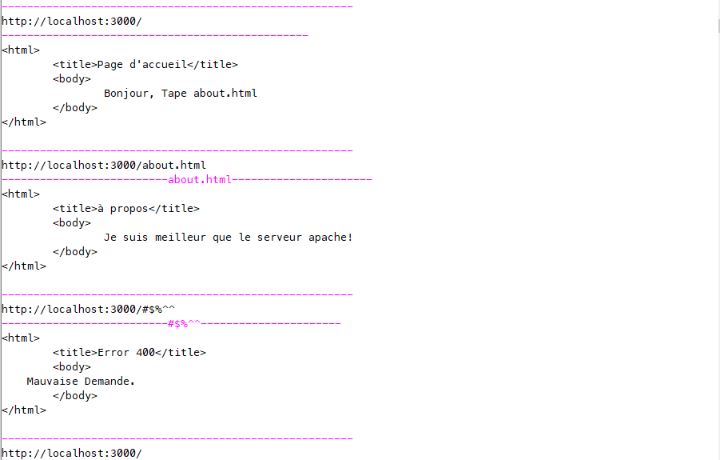
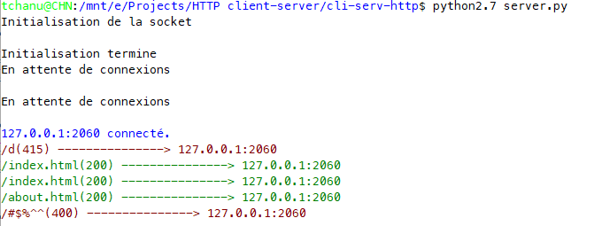

# Simple HTTP Client-Server

This is very simple HTTP client-server model written on python.

## Getting Started

Program doesn't include installation. 

### Prerequisites

You need python 2.7.x to run this application.

## Screenshots
#### Client

#### Server

